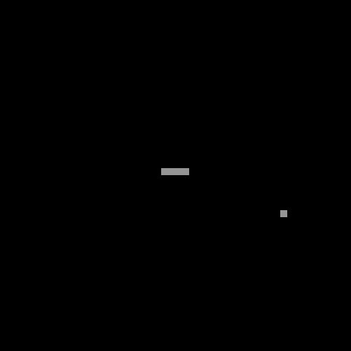

# Un snake réalisé avec [P5.js](https://p5js.org/)

Pour y jouer, vous devez utiliser **les flèches directionnelles** :arrow_up: :arrow_right: :arrow_down: :arrow_left:

[Accessible ici](https://balthazar-delvaux.github.io/Snake/)

----------
## Languages utilisés

- HTML
- Javascript

## Screenshot

## [P5.js](https://p5js.org/)

P5.js est une bibliothèque JavaScript très utile dans les créations graphiques et elle est très facile à prendre en main.

----------

Mon premier projet en JavaScript!
